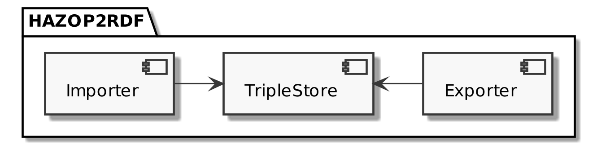
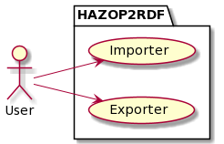
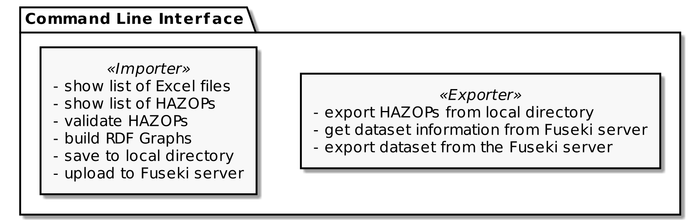

# Concept

* How did we solve the problem(framework)
* How did we get to the concept?
* Why did we choose this method of implementing

## Design program components

We decided to structure our solution into three separate programs, all of which can stand alone, and operate independent of each other; and a Command Line User Interface for easier operability.
•	The Importer: Takes an Excel HAZOP-analysis file, validates it, converts the table structure into RDF-Triples, and finally stores the created RDF-Triples with all metadata either locally or in the TripleStore.
•	The Exporter: Takes a HAZOP-analysis in RDF-Triples, extracts information and metadata, and stores them in the industry standard formatting in an Excel file.
•	The TripleStore: Fuseki server that stores HAZOP data in RDF-Triples. Acting as a central database for machine readable completed HAZOP-Analysis with easy accessibility. 
Great care was taken to design the programs separate and allow for alternative and independent use cases with a focus on reusability. Thus, both the Importer and Exporter are capable of reading and storing data locally or through the TripleStore database. Likewise, the TripleStore is useable for multiple purposes and not limited to just the storing of HAZOP-triples. 

### Diagram

## User interaction scenario

### Diagram

## Design Command Line Interface

To take full advantage of the modularity of our solution, a Command Line User Interface was chosen. This allows specific access to all functionalities of only the Importer and Exporter programs and eliminates convolution of the separate functions inside each program through precise commands. For security reasons, the user is only able to communicate with the Triplestore indirectly through Importer and Exporter functions. This furthermore ensures that data on the Triplestore will not be corrupted through operator errors.

### Diagram

