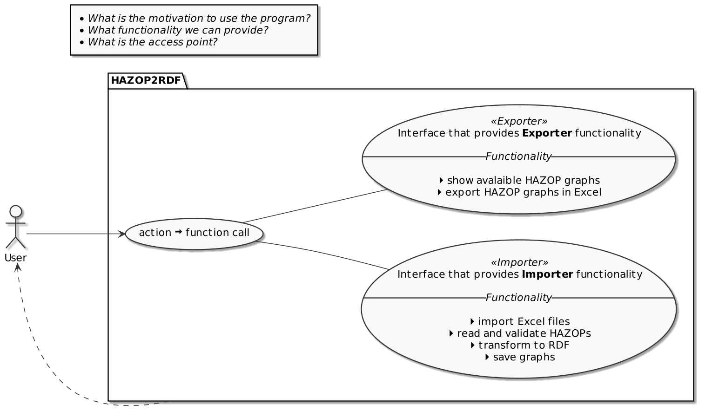

\newpage

# Concept

## Program component design

We decided to structure our solution into separate components. The components should contain utilities to perform certain actions with the incoming HAZOP data.

-   **The Importer** should take the HAZOPs, validate them and convert them into the RDF format. Finally, the created RDF-Graph with all metadata is stored either locally or uploaded on the Fuseki server.
-   **The Exporter** should take the RDF-Graphs, parse the information and metadata, and store them in an Excel file.
-   **The TripleStore** is a Fuseki server API. It stores HAZOP data in RDF-Triples. Acting as a central database for machine-readable, completed HAZOP-Analysis with easy accessibility.

We planned to integrate the components through dependency injection and open the functionality of the components to each other. So, we can perform the complete cycle of RDF transformation from and to the Excel format.

## User experience design

Through the communication with the program the user should have the opportunity to load, read and store the HAZOPs in either format.

The concept allows the interaction with up to two interfaces, the importer and exporter.

On the following diagram we show the concept of the user interaction with the program. Using a program interface the full cycle of HAZOP2RDF transformation should be accessible to the user.

## Command Line Interface design 

We choose a Command Line Interface (CLI) as a fundament for our project. The CLI should be able to provide the complete spectrum of the importer and exporter functionality to the user.

The diagram below shows the main features of the Command Line Interface.

