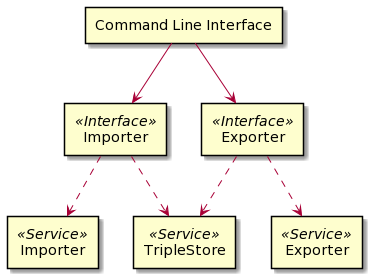
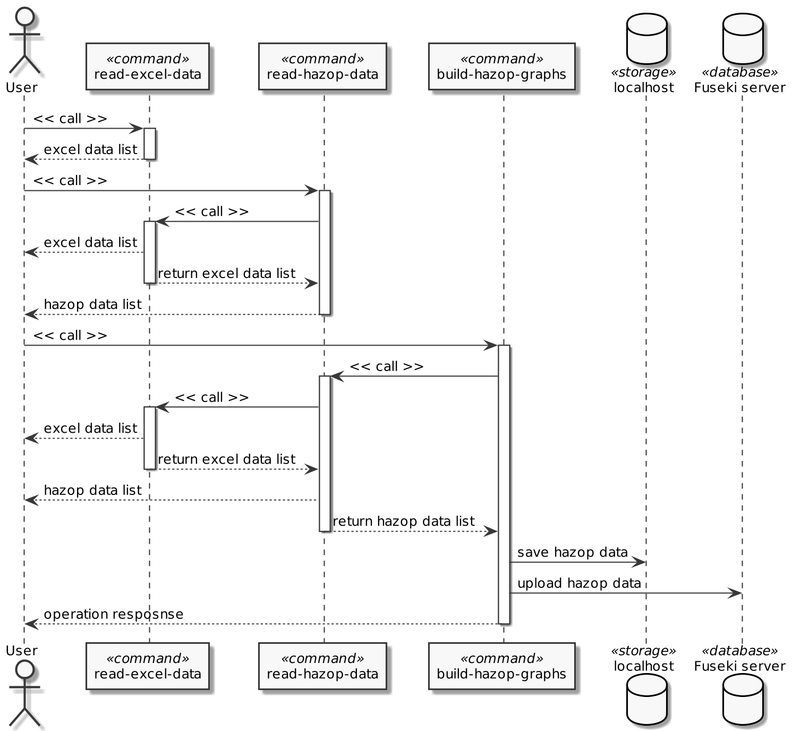
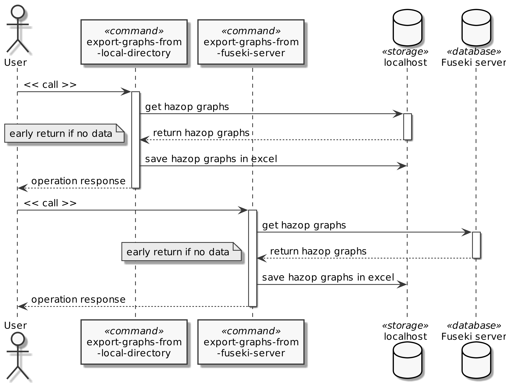

# Implementation
    
We implemented the Command Line Interface using Click[^1] package. It is highly configurable and can build very complex applications. The ComplexCLI utility, we used in our project, combines multiple interfaces in a single Command Line Interface.

The following diagram shows the structure of the Command Line Interface. It contains Importer and Exporter interfaces, which use services. The services contain utilities needed for the interfaces to perform lower level actions.

{ width=70% }

Using the Command Line Interface users can interact with our software.
     
Using our Importer interface the user can import and validate incoming HAZOP data in Excel format and generate RDF graphs from it. They can be locally stored or uploaded to a Fuseki server.
     
Using our Exporter interface the user can export RDF graphs containing HAZOP data to the Excel format. The source for the Exporter interface can either be a locally stored RDF file or a RDF file stored on a Fuseki server.
    
## Importer interface
    
The main purpose of the Importer interface is to build an RDF graph from incoming Excel data. To build an RDF graph, we carefully read the incoming HAZOP data and validate it. To validate the data correctly we implemented a config file, which stores all the metadata needed to describe the importing and validation processes.

The main command of the Importer interface is cmd-build-hazop-graphs, which reads the HAZOP data stored in a local directory and transforms it to an RDF graph. The graph can then be stored locally or uploaded to a Fuseki server. The two other commands cmd-read-excel-data and cmd-read-hazop-data can be used to check the local directory for the existing data.

The installation of a Fuseki server is optional. If the server is offline, the files cannot be uploaded to the server resulting in a warning message, which is displayed to the user.

## Exporter interface

After the HAZOP data was successfully imported and stored, the user can convert the RDF graph to the Excel format again.

There are two main commands in the Exporter interface for the user to interact with. The user can either export data from an RDF file located in a local directory or from a file located online on a Fuseki server. For the successful export from the Fuseki Server, the server needs to be running.

As a result, the RDF graphs will be stored locally in the Excel format again.

    
## Remarks

We developed the HAZOP2RDF project with version control on GitHub. The program is available for Windows and macOS. We also included a detailed installation guide in the documentation.

[^1]: Python package: [Click](https://click.palletsprojects.com/en/8.0.x/)