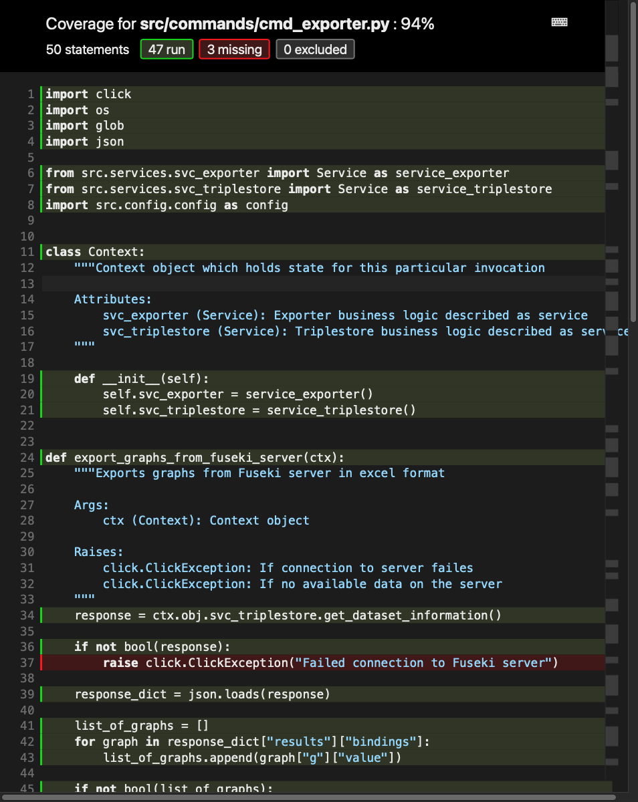

# Appendix

```{.ttl caption="HAZOP ontology in Turtle format"}
@prefix blanknode: <http://www.hazop2rdf.de/hazop/blanknode/> .
@prefix hazopcase: <http://www.hazop2rdf.de/hazop/hazopcase/> .
@prefix predicate: <http://www.hazop2rdf.de/hazop/predicate/> .
@prefix xsd: <http://www.w3.org/2001/XMLSchema#> .

hazopcase:1 blanknode:cause [ predicate:description "Zugeführtes Prozessmedium zu heiß (>200°C)" ;
            predicate:guideword "Mehr" ;
            predicate:hazopnode "In 1 - Feed-Eingang" ;
            predicate:parameter "Temperatur" ] ;
    blanknode:consequence [ predicate:description "Materialversagen der Dichtungen, Leckage" ;
            predicate:guideword "NaN"^^xsd:double ;
            predicate:hazopnode "Speicherbehälter" ;
            predicate:parameter "NaN"^^xsd:double ] ;
    blanknode:deviation [ predicate:description "Überschreitung der zulässigen Temperatur im Behälter" ;
            predicate:guideword "Mehr" ;
            predicate:hazopnode "Speicherbehälter" ;
            predicate:parameter "Temperatur" ] ;
    blanknode:restrisiko [ predicate:avoiding "G2 - fast unmöglich" ;
            predicate:presence "A2 - häufig bis andauernd" ;
            predicate:probability "W2 - gering" ;
            predicate:severity "S1 - minimale " ] ;
    blanknode:riskgraph [ predicate:avoiding "G2 - fast unmöglich" ;
            predicate:presence "A2 - häufig bis andauernd" ;
            predicate:probability "W2 - gering" ;
            predicate:severity "S2 - geringe" ] ;
    blanknode:safeguard [ predicate:hazopnode "Speicherbehälter" ;
            predicate:otherinfo "NaN"^^xsd:double ;
            predicate:parameter "Hochwertige Dichtungen für Temp. über 200°C (bei 25bar)" ;
            predicate:recommendation "NaN"^^xsd:double ] .

hazopcase:10 blanknode:cause [ predicate:description "reines Lösungsmittel wird zugeführt" ;
            predicate:guideword "Kein" ;
            predicate:hazopnode "In 1 - Feed-Eingang" ;
            predicate:parameter "Konzentration" ] ;
    blanknode:consequence [ predicate:description "kein" ;
            predicate:guideword "NaN"^^xsd:double ;
            predicate:hazopnode "Speicherbehälter" ;
            predicate:parameter "NaN"^^xsd:double ] ;
    blanknode:deviation [ predicate:description "nur reines Lösungsmittel in Behälter" ;
            predicate:guideword "Kein" ;
            predicate:hazopnode "Speicherbehälter" ;
            predicate:parameter "Konzentration" ] ;
    blanknode:restrisiko [ predicate:avoiding "NaN"^^xsd:double ;
            predicate:presence "NaN"^^xsd:double ;
            predicate:probability "NaN"^^xsd:double ;
            predicate:severity "NaN"^^xsd:double ] ;
    blanknode:riskgraph [ predicate:avoiding "G1 - möglich" ;
            predicate:presence "A2 - häufig bis andauernd" ;
            predicate:probability "W3 - relativ hoch" ;
            predicate:severity "S1 - minimale " ] ;
    blanknode:safeguard [ predicate:hazopnode "In 1 - Feed-Eingang" ;
            predicate:otherinfo "NaN"^^xsd:double ;
            predicate:parameter "keine Aktion erforderlich" ;
            predicate:recommendation "Normalzustand" ] .
```


