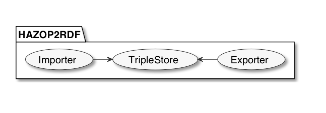
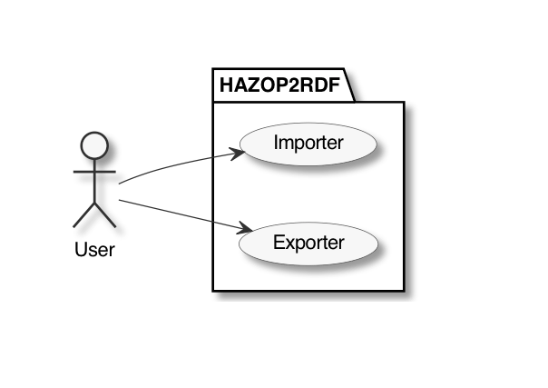
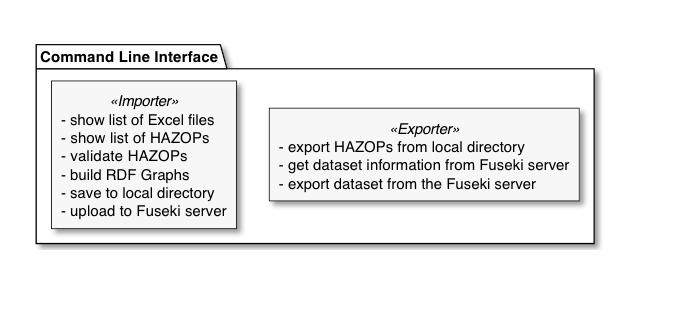

# Concept

* How did we solve the problem(framework)
* How did we get to the concept?
* Why did we choose this method of implementing


_PlantUML settings_

```plantuml
skinparam monochrome true
skinparam ranksep 20
skinparam dpi 150
skinparam arrowThickness 1
skinparam packageTitleAlignment left
skinparam usecaseBorderThickness 1
skinparam defaultFontSize 18
skinparam rectangleBorderThickness 1
skinparam componentStyle rectangle
```


# Design program components

How did we start?
What are the main components of the program?

## Diagram code

```plantuml
package HAZOP2RDF {
  [Importer] -> [TripleStore]
  [TripleStore] <- [Exporter]
}
```

## Diagram PNG




# User interaction scenario

How should users interact with the program?

## Diagram code

```plantuml
actor User

package HAZOP2RDF {
  usecase Importer
  usecase Exporter
}

User ----> Importer
User ----> Exporter
```

## Diagram PNG




# Design Command Line Interface

What would the command line interface structure look like?

## Diagram code

```plantuml
package "Command Line Interface" {
  rectangle "- export HAZOPs from local directory\n- get dataset information from Fuseki server\n- export dataset from the Fuseki server" << Exporter >>
  rectangle "- show list of Excel files\n- show list of HAZOPs\n- validate HAZOPs\n- build RDF Graphs\n- save to local directory\n- upload to Fuseki server" << Importer >>
}
```

## Diagram PNG


